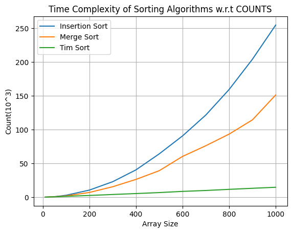

# Sorting Algorithm Comparison

This repository is for comparing the complexities of three sorting algorithms:

1. Insertion sort
2. Merge Sort
3. Tim Sort

## Comparisons

**Two types of comparisons are performed:**

1. Comparison w.r.t the total number of swaps performed and total number of array values compared with each other.
2. Comparison w.r.t the execution time taken to complete the sorting.

## Setup

To use this repository:

1. Clone this repository using one of the following commands:
    - For HTTPS: `git clone https://github.com/jagankasula/SORT-ALGORITHMS.git`
    - For SSH: `git clone git@github.com:jagankasula/SORT-ALGORITHMS.git`
2. Move to the root directory (`SORT-ALGORITHMS`).
3. Run the command `python3 Driver.py`.
   - This command will print the results to the console.
   - Sample results:
        ```python
        For DATA_SIZE = [10, 50, 100, 200, 300, 400, 500, 600, 700, 800, 900, 1000], the results are

        insertion_sort_counts = [34, 676, 2753, 10417, 22808, 40336, 64064, 90616, 121546, 159337, 204081, 254750]
        merge_sort_counts = [32, 582, 1822, 6939, 15363, 26229, 39135, 60259, 76107, 93322, 114344, 151251]
        tim_sort_counts = [35, 482, 1201, 2479, 3919, 5308, 6744, 8499, 9853, 11537, 13091, 14598]
        insertion_sort_time = [0.0, 0.1, 0.3, 1.0, 2.1, 3.9, 6.4, 8.9, 12.5, 15.1, 19.5, 24.6]
        merge_sort_time = [0.0, 0.1, 0.4, 1.6, 3.7, 6.4, 10.3, 16.2, 18.7, 22.1, 26.9, 35.3]
        tim_sort_time = [0.0, 0.1, 0.1, 0.3, 0.5, 0.6, 0.8, 1.0, 1.1, 1.3, 1.5, 1.7]
4. To generate the plots for above mentioned comparision types uncomment the relevant code from line 50 in `Driver.py` file.
    - Sample plots:
        
        